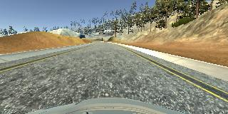
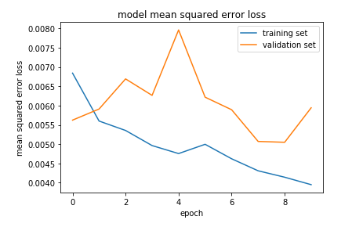
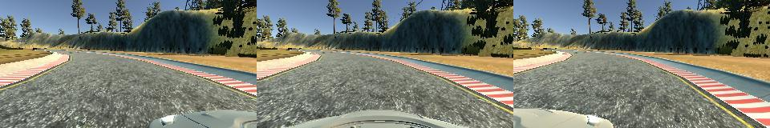

# Behaviorial Cloning Project

This project was a submission for Udacity's Self-driving Car Nanodegree. The aim of this project is to build and train a convolutional neural network (CNN) that capable of steering a car in the simulator. This involved in learning from prior driving behaviour. It is built based on Python ,Keras, tensorflow as backend and implemented NVIDIA's end-to-end learning model. The model is trained on a NVIDIA GTX1060.

## CNN Model Architecture

Implementation of [NVIDIA' end-to-end learning model](https://devblogs.nvidia.com/parallelforall/deep-learning-self-driving-cars/).

Every convolutional layer is activated with a RELU function to introduce non-linearity. Dropouts are introduced after every fully connected layer except for the final layer. It is used to prevent overfitting.

The error was finally calculated with a MSE(means-squared error) function. 
Learning parameters
..* AdamOptimizer
..* Batch sizes : 32
..* Dropout : 0.3
..* Epochs : 10

### Visualizing Loss

## Dataset setup

### Steering and Throttle Control
The training dataset is collected by recording my driving behavior with Udacity's Unity simulator. Steering and throttling were controlled with a mouse and keyboard. By using the mouse input as steering, it provide finer control than keyboard input. It can help to drive smoothly around the curves.

### Left, Center and Right Views

### Mirroring Driving image

### Recovery Driving

## Strategy and Design

## Conclusion
