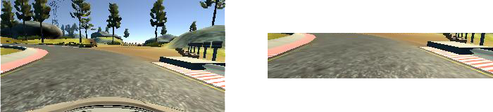
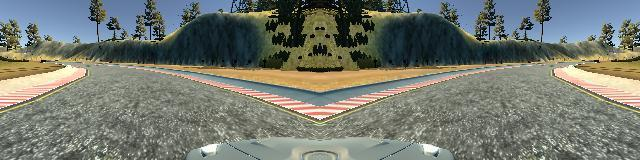

# Behaviorial Cloning Project

This project was a submission for Udacity's Self-driving Car Nanodegree. The aim of this project is to build and train a convolutional neural network (CNN) that capable of steering a car in the simulator. This involved in learning from prior driving behaviour. It is built based on Python ,Keras, tensorflow as backend and implemented NVIDIA's end-to-end learning model. The model is trained on a NVIDIA GTX1060.

## CNN Model Architecture

Implementation of [NVIDIA' end-to-end learning model](https://devblogs.nvidia.com/parallelforall/deep-learning-self-driving-cars/).

Every convolutional layer is activated with a RELU function to introduce non-linearity. Dropouts are introduced after every fully connected layer except for the final layer. It is used to prevent overfitting.

The error was finally calculated with a MSE(means-squared error) function. 
Learning parameters
* AdamOptimizer
* Batch sizes : 32
* Dropout : 0.3
* Epochs : 10

### Visualizing Loss

## Dataset setup

### Steering and Throttle Control
The training dataset is collected by recording my driving behavior with Udacity's Unity simulator. Steering and throttling were controlled with a mouse and keyboard. By using the mouse input as steering, it provide finer control than keyboard input. It can help to drive smoothly around the curves.

### Left, Center and Right Views

The simulator captures images from three cameras mounted on the car: a center, right and left camera.

### Image Cropping and Normalisation

Images are cropped top and bottom. These portions contain redundant features like the vehicle's bonnet and sky. Images were then normalised using lambda to bring their values between -0.5 and 0.5.

### Mirroring Driving image

In order to help the model generalise better, all images were flipped horizontally, and their steering angles reversed. This provides a counter to each run of the track, alleviating any concerns of left-right bias in steering input. It also double the training datasets.

### Recovery Driving

In the simulator driving circuit, some areas have sharp curved turn. The vehicle needed help to learn how to recover from off-center situations. More recovery driving dataset are recorded in those areas. 

### Data Collection

* 4 laps of clockwise center lane driving
* 4 laps of anti-clockwise center lane driving
* 1 lap of recovering driving from the sides
* 1 lap focusing on driving smoothly around curves

## Strategy and Design

After I had done some research on the existing model architecture for self driving car, I decided to use NVIDIA's end-to-end deep learning network. It is fairly trivial to build in Keras. 

I spent most of my time fine tuning the training parameters. After much testing, I found out the suitable training paramters for my model.

## Conclusion

This project is interesting and fun. The result is relatively good in low speed driving. The current model does not cover all the edge cases for driving recovery. It require more datasets to respond for all edge cases. 
